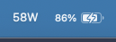
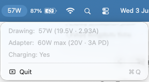

# wattusb

Tiny macOS menu bar app that shows the live wattage your Mac is currently drawing — from its USB-C / MagSafe charger when plugged in, or from the battery when not.

<p align="center">
  
  &nbsp;&nbsp;
  
</p>

Useful for:

- Telling whether a given charger is actually delivering its rated power.
- Comparing ports on multi-port chargers (the "fast" port vs the slower ones).
- Sanity-checking cables — a flaky cable will cap the negotiated voltage and the wattage drops accordingly.
- Seeing how much power your Mac is sipping when running on battery.

## What it shows

**Menu bar**: a single number, e.g. `58W`.

- **Plugged in** — total watts coming in from the charger.
- **On battery** — watts being drawn from the cells (i.e. what your Mac is consuming right now).

**Click for details when plugged in**:

```
In:          58W (19.5V · 2.98A)
Adapter:     60W max (20V · 3A PD)
To battery:  31W
To system:   27W
Battery:     88%  ·  1h 22m to full
─────────
Quit
```

- **In** — real-time watts flowing in from the charger.
- **Adapter** — the PD contract the charger negotiated (its advertised max).
- **To battery** / **To system** — how the input watts split between charging the cells and running the Mac.
- **Battery** — current charge level, plus time-to-full when actively charging.

**Click for details on battery**:

```
Drawing:     12W from battery
Battery:     88%  ·  6h 30m left
Not plugged in
─────────
Quit
```

Updates every 2 seconds.

## Install

```sh
git clone https://github.com/benlumley/wattusb.git
cd wattusb
sh build.sh
mv wattusb.app /Applications/
open /Applications/wattusb.app
```

Requires macOS 14+ and Xcode command-line tools.

The build script produces a universal binary (Apple Silicon + Intel) and ad-hoc signs it so Gatekeeper lets it launch.

## How it works

All data comes from IOKit's `AppleSmartBattery` service:

- Live input draw — `PowerTelemetryData.SystemPowerIn` (mW from the adapter)
- Input voltage / current — `SystemVoltageIn`, `SystemCurrentIn`
- PD contract — `AdapterDetails.Watts`, `AdapterVoltage`, `Current`
- Battery side — `Voltage` × `Amperage` (signed: positive = charging, negative = discharging)
- Battery level / time — `CurrentCapacity`, `TimeRemaining`
- State flags — `ExternalConnected`, `IsCharging`

No entitlements, no network, no preferences, no launch agent. The whole app is one Swift file (~140 lines). It's an `LSUIElement` app so there's no dock icon and no main window.

The status item title uses `NSFont.menuBarFont(ofSize: 11)` via `attributedTitle` to line up with the Control Center battery percentage.

## Quit

Click the menu bar item → Quit (or `⌘Q` while the menu is open).

## License

MIT.
